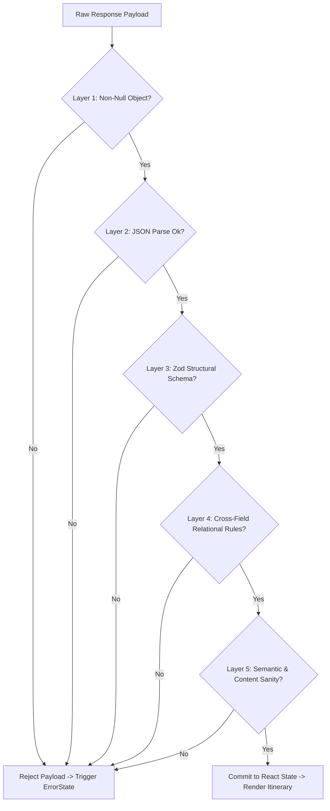

# Architecture & Engineering Decisions

## Problem Statement & Context

Building an AI-driven web application presents a unique software engineering challenge: **how to convert unpredictable, probabilistic Large Language Model (LLM) outputs into reliable, deterministic application state.**

In traditional software, backend APIs adhere to rigid schemas, return known status codes, and rarely alter their response types unexpectedly. In contrast, LLMs may hallucinate keys, return invalid enums, produce mismatched day counts, skip sequence numbers, or embed placeholder values.

This document outlines the architectural decisions, design patterns, validation layers, state management principles, and defensive engineering strategies implemented in the **Flam AI React Trip Planner**.

---

## 1. Core Design Principle

> **Treat the LLM as an untrusted external data source, not as a trusted application backend.**

In this application, the LLM output is subjected to the same level of suspicion and defense as unvalidated user input or untrusted third-party webhooks.

```text
Untrusted Model Output
          ↓
[ Gate 1: Existence & Shape Check ]
          ↓
[ Gate 2: Safe JSON Parse Boundary ]
          ↓
[ Gate 3: Zod Structural Schema Validation ]
          ↓
[ Gate 4: Cross-Field & Relational Integrity ]
          ↓
[ Gate 5: Semantic & Placeholder Filtering ]
          ↓
Trusted React Application State
```

The application renders zero UI elements from the AI response until it has passed all five validation gates.

---

## 2. Data Contract First

Before writing frontend components or backend routes, the shared itinerary contract was defined. Establishing an explicit contract decouples the presentation layer from the LLM implementation.

### The Canonical Itinerary Contract

```typescript
interface TripMeta {
  destination: string;      // Non-empty, max 100 chars, no placeholders
  durationDays: number;     // Integer between 1 and 30
  summary: string;          // Non-empty, max 500 chars
}

type StopType = 
  | 'sightseeing' 
  | 'food' 
  | 'culture' 
  | 'shopping' 
  | 'nature' 
  | 'relaxation' 
  | 'activity';

type BestTime = 
  | 'early-morning' 
  | 'morning' 
  | 'afternoon' 
  | 'evening' 
  | 'night';

interface Stop {
  id: string;               // Non-empty string, globally unique across itinerary
  name: string;             // Non-empty, max 150 chars
  type: StopType;           // Validated enum
  description: string;      // Non-empty, max 500 chars
  durationMinutes: number;  // Positive integer (1 to 1440)
  bestTime: BestTime;       // Validated enum
}

interface Day {
  dayNumber: number;        // Sequential integer starting at 1
  title: string;            // Non-empty, max 100 chars
  summary: string;          // Non-empty, max 300 chars
  stops: Stop[];            // Array with 1 to 8 stops
}

interface TripData {
  trip: TripMeta;
  days: Day[];              // Length must strictly match trip.durationDays
}
```

By standardizing this shape, the React UI components (`ResultView`, `DayCard`, `StopCard`) can rely on strictly typed, non-null properties without defensively embedding fallback ternary operators throughout the JSX.

---

## 3. Layered Validation Strategy

Validation is implemented as a multi-tier pipeline in `client/src/lib/validateTrip.js`. Each layer addresses a distinct failure mode:



### Layer 1 — Response Existence
Guards against `null`, `undefined`, empty string, array, or primitive responses returned by network errors or malformed proxies.

### Layer 2 — Safe JSON Parsing Boundary
Converts raw serialized text into JavaScript objects within a dedicated `try/catch` wrapper, ensuring syntax errors from truncated responses do not throw unhandled exceptions into the React lifecycle.

### Layer 3 — Structural Validation (Zod)
Using `tripSchema.safeParse(data)`:
- Enforces strict object properties (`.strict()`), rejecting unexpected root or nested fields.
- Validates field types (`string`, `number`, `array`, `object`).
- Verifies string length and whitespace constraints (`min(1)`, `max(...)`, `trim().length > 0`).
- Validates enum values for `StopType` and `BestTime`.
- Enforces numeric constraints (`.int()`, `min(1)`, `max(30)` for days; `1..1440` for stop duration).
- Enforces array bounds (`1..8` stops per day).

### Layer 4 — Cross-Field Relational Integrity
Rules that cannot be expressed via single-field schemas:
1. **Duration-to-Day Alignment**: `itinerary.days.length === itinerary.trip.durationDays`. If a prompt asks for 3 days, the AI cannot return 2 or 4 days.
2. **Sequential Day Numbering**: `days[i].dayNumber === i + 1`. Detects skipped (`[1, 3]`), 0-indexed (`[0, 1]`), or duplicate (`[1, 1]`) day numbers.
3. **Global Stop ID Uniqueness**: Ensures stop identifiers are globally unique across all days, preventing key collisions in React list rendering and stop mutations.

### Layer 5 — Semantic & Content Sanity Checks
Guards against low-quality or placeholder AI outputs:
- **Placeholder Detection**: Rejects text matching common LLM placeholder tokens (`"string"`, `"example"`, `"unknown"`, `"N/A"`, `"test"`, `"Lorem ipsum"`, `"some place"`, `"some restaurant"`).
- **Generic Day Detection**: Rejects empty filler days (e.g. Title: `"Day 1"` + Summary: `"Explore the city"`).
- **Duplicate Stop Names & Descriptions**: Detects copy-pasted stop entries across different days.
- **Contradictory Category Mismatches**: Flags obvious category conflicts (e.g. a `"pizzeria"` categorized as `'nature'`).
- **Unsupported Real-Time Claims**: Detects claims of live information the model cannot reliably guarantee (e.g. *"open from 9am today"*, *"entry fee is exactly $12"*).

---

## 4. Why Validation Happens Before React State

In many naive React implementations, API responses are directly saved to state:

```javascript
// ANTIPATTERN (Unsafe):
const data = await fetch('/generate').then(r => r.json());
setItinerary(data); // State now contains untrusted data
```

This antipattern forces child components to defensively guard against missing arrays or undefined fields:
```jsx
// Burden placed on UI components:
<h4>{day?.title || 'Day'}</h4>
{day?.stops?.map(stop => ...)}
```

### The Invariant in This Project:
```javascript
// PREFERRED PATTERN (Defensive Gate):
const rawData = await generateItinerary(input);
const validation = validateTrip(rawData);

if (!validation.valid) {
  setError({
    title: 'We received an invalid itinerary',
    message: 'The AI returned data that does not match the itinerary requirements.',
  });
  return;
}

setItinerary(validation.data); // Pure, validated data only
```

### Advantages:
1. **Zero Partial Renders**: Broken or incomplete itineraries are never partially mounted.
2. **Predictable Component Props**: Components receive clean, guaranteed data structures.
3. **Simplified Testing**: UI components can be tested against the contract without mocking every possible undefined permutation.

---

## 5. API Boundary & Server Proxy

The frontend does not call Google Gemini directly. All communication routes through a dedicated Express server.

```text
React Client (Vite :5173)
        ↓ POST /generate { input }
Express Server (:5000)
        ↓ ai.models.generateContent({ responseSchema, ... })
Google Gemini API
```

### Rationale:
1. **Secret Isolation**: `GEMINI_API_KEY` is kept exclusively on the server. No client bundle inspection or network inspection can reveal the key.
2. **Schema Enforcement at Provider Level**: The server configures Gemini's `responseSchema` feature (`@google/genai`), forcing the LLM to return valid JSON adhering to `itinerarySchema` rather than conversational markdown.
3. **Timeout Wrapping**: Outgoing Gemini requests are raced against a 30-second server timeout (`Promise.race`), preventing hung connections.

---

## 6. Stable Error Contract

Raw errors from external AI providers are non-deterministic and frequently change format. The Express backend and client API layer normalize upstream errors into stable machine-readable codes.

```text
Gemini SDK Exception (503 UNAVAILABLE / Rate Limit / Timeout)
        ↓
Express Backend Normalization (routes/generate.js)
        ↓ JSON { success: false, error: { code: "LLM_UNAVAILABLE", ... } }
Client API Layer (lib/api.js -> ApiError)
        ↓ getUserFriendlyError(err)
User-Facing UI Error State (ErrorState.jsx)
```

### Normalized Error Codes:
- `LLM_UNAVAILABLE` (HTTP 503): High demand or upstream capacity limits.
- `INVALID_INPUT` (HTTP 400): Empty or whitespace-only prompt.
- `LLM_TIMEOUT` (HTTP 504): Gemini request exceeded 30s threshold.
- `LLM_CONFIGURATION_ERROR` (HTTP 500): Server missing API key.
- `NETWORK_ERROR` (Status 0): Client cannot reach backend.
- `VALIDATION_ERROR` (Client): Payload violated data contract.

---

## 7. Asynchronous Request Safety (Race Condition Protection)

When users submit prompts in rapid succession, responses may resolve out of order.

```text
Timeline:
t0: User submits Request A ("Hyderabad", slow network)
t1: User submits Request B ("Kyoto", fast network)
t2: Request B resolves -> UI renders Kyoto
t3: Request A resolves later -> MUST NOT overwrite Kyoto with Hyderabad!
```

### Solution: `requestIdRef` Counter

In `App.jsx`:
```javascript
const requestIdRef = useRef(0);

async function handleGenerate() {
  const currentRequestId = ++requestIdRef.current;
  setLoading(true);

  try {
    const data = await generateItinerary(input);
    if (currentRequestId !== requestIdRef.current) return; // Discard stale response

    const validation = validateTrip(data);
    if (!validation.valid) { ... }

    setItinerary(validation.data);
  } catch (err) {
    if (currentRequestId !== requestIdRef.current) return; // Discard stale error
    setError(friendlyError);
  } finally {
    if (currentRequestId === requestIdRef.current) {
      setLoading(false);
    }
  }
}
```

This ensures the UI state, error state, and loading spinner always match the **latest user intent**.

---

## 8. React State Architecture

State is divided strictly between **application-level domain state** and **local presentation state**.

```text
App.jsx (Application Root)
 ├── input       (string)   -> User's current prompt
 ├── itinerary   (TripData) -> Validated itinerary data
 ├── loading     (boolean)  -> In-flight request status
 ├── error       (object)   -> Current error or null
 └── theme       (string)   -> 'dark' | 'light' (localStorage)

DayCard.jsx (Local Component State)
 └── expanded    (boolean)  -> Accordion visibility (default: true)
```

### Decision: No External State Library
For this application scope, React's built-in `useState` and `useRef` provide clear, predictable state management without the overhead of Redux, Zustand, or MobX.

---

## 9. Immutable Itinerary Operations

User interactions (removing stops, reordering stops) update state immutably:

```javascript
function handleRemoveStop(dayNumber, stopId) {
  setItinerary(prev => {
    if (!prev) return prev;
    return {
      ...prev,
      days: prev.days.map(day => {
        if (day.dayNumber !== dayNumber) return day; // Unchanged reference
        return {
          ...day,
          stops: day.stops.filter(stop => stop.id !== stopId),
        };
      }),
    };
  });
}
```

### Key Property: State Isolation
Modifying stops on Day 1 creates a new object reference only for Day 1. Day 2 and Day 3 preserve their existing memory references, avoiding unnecessary re-renders.

---

## 10. Defensive UI Architecture

The component hierarchy follows a strict parent-to-child data flow:

```text
App.jsx (Owns state and mutation handlers)
 └── ResultView.jsx (Presentational trip header & day list)
      └── DayCard.jsx (Day anchor, expand button, stop container)
           └── StopCard.jsx (Sequential index, category badge, reorder/remove buttons)
```

- Components do not fetch data or mutate global state directly.
- Actions (`onRemoveStop`, `onMoveStop`) are passed down as callbacks.
- Buttons have accessible labels (`aria-label="Remove stop: Charminar"`), title tooltips, and boundary disabled states (`disabled={isFirst}`).

---

## 11. Failure-First Design Matrix

| Failure Mode | Detection Layer | System Behavior |
| :--- | :--- | :--- |
| Empty / whitespace prompt | Frontend + Backend 400 | Submit disabled; 400 returns prompt hint |
| Gemini rate limited / 503 | Server error classification | Normalized to `LLM_UNAVAILABLE`, retry banner shown |
| Network drop / CORS failure | Client `fetch()` catch | Throws `NETWORK_ERROR`, connection banner shown |
| Gemini timeout (>30s) | Server `Promise.race` | Returns 504 `LLM_TIMEOUT`, prompt preserved |
| Malformed JSON string | Client `JSON.parse` | Safe catch, returns `INVALID_RESPONSE` |
| Missing required schema fields | Client Zod validation | `validateTrip` returns `valid: false`, shows error |
| Day count !== durationDays | Custom semantic check | Rejected with exact mismatch reason |
| Duplicate stop IDs | Custom semantic check | Rejected before list rendering |
| Placeholder values in text | Custom semantic check | Rejected before state update |
| Out-of-order API resolution | `requestIdRef` counter | Stale response silently dropped |

---

## 12. Testing Strategy

The automated test suite is built on **Vitest** and **React Testing Library**:

```text
tests/
 ├── validation/       # Direct unit tests of Zod and custom semantic rules
 ├── api/              # Unit tests for fetch dispatch and error mapping
 ├── integration/      # E2E user flows, error banners, loading, race conditions
 └── components/       # Isolated component rendering and accessibility checks
```

### Deterministic Test Principles:
1. **Zero Real API Calls**: All tests use mocked responses to ensure speed, determinism, and zero Gemini quota consumption.
2. **Deferred Promise Concurrency Testing**: Race condition tests use controlled deferred promises (`requestA.resolve()`, `requestB.resolve()`) rather than arbitrary `setTimeout` delays.
3. **Full Lifecycle Verification**: Tested that invalid AI outputs never reach rendered state, while valid responses reliably render.

### Verified Test Results:
- **144 tests passing** across **14 test files**.
- **Coverage**: **96.78%** Lines, **93.36%** Statements, **86.17%** Branches, **95.65%** Functions.

---

## 13. Key Engineering Trade-offs

### 1. Zod + Custom Rules vs. Pure Zod
- **Trade-off**: Adding custom JavaScript functions alongside Zod.
- **Rationale**: Zod excels at schema and type enforcement. However, cross-field validations (e.g. global stop ID uniqueness across nested arrays, day count matching trip duration, and domain-specific placeholder checks) are cleaner, faster, and more readable in dedicated JavaScript functions than deeply nested `.refine()` chains.

### 2. Client-Side Validation vs. Backend-Only Validation
- **Trade-off**: Validating in the browser bundle.
- **Rationale**: The client is the ultimate consumer of the data. Performing validation at the client boundary guarantees that regardless of network intermediaries or backend changes, the React render tree is always protected.

### 3. Monochromatic Editorial Design System vs. Heavy CSS Framework
- **Trade-off**: Custom vanilla CSS tokens vs. TailwindCSS / Material UI.
- **Rationale**: A tailored CSS architecture inspired by quiet luxury and precision engineering achieves a distinct editorial aesthetic, reduces bundle size, and gives pixel-level control over responsive typography and dark/light mode transitions.

---

## 14. Scope Boundaries

To maintain focus on the core assignment requirements, the following features were intentionally excluded from this release:
- Multi-user authentication & authorization
- Database persistence for saved trips
- Interactive map tiles & route geometry
- Live booking & pricing APIs
- Real-time weather widgets
- Conversational chat / follow-up prompts

---

## 15. Future Roadmap & Enhancements

With additional development time, the following improvements could be introduced:
1. **Streaming JSON Parsing**: Incrementally render days as Gemini streams tokens using a streaming JSON parser.
2. **Local Trip Persistence**: Save itineraries to `IndexedDB` or `localStorage` for offline review.
3. **Export Formats**: PDF, iCal (`.ics`), and Google Calendar export.
4. **Interactive Map Coordinates**: Integrate Mapbox / Leaflet to visualize validated stop coordinates.
