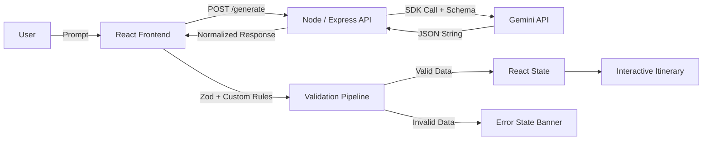

# AI Trip Planner

A high-reliability, interactive AI Trip Planner built with **React (Vite)** and **Node.js (Express)**, powered by **Google Gemini**.

Designed for the **Flam AI Frontend **, this application turns natural-language travel requests into validated, interactive day-by-day itineraries.

```text
Free-form trip request
        ↓
React frontend (controlled input & state management)
        ↓
Node / Express API (proxy & API key isolation)
        ↓
Gemini (structured JSON via responseSchema)
        ↓
Frontend validation pipeline (Zod schema + semantic rules)
        ↓
Interactive React itinerary (expand, remove, reorder)
```

> **Note**: This application is intentionally **not a conversational chatbot**. Instead, the LLM functions as a structured data generator whose output is validated against strict contracts before entering React state.

---

## Features

- **Free-Form Trip Input**: Accepts natural-language trip requests with keyboard shortcut support (<kbd>Ctrl</kbd>/<kbd>Cmd</kbd> + <kbd>Enter</kbd>).
- **Structured Day-by-Day Itineraries**: Renders a comprehensive trip overview, day themes, and sequential activity stops.
- **Defensive Multi-Tier Validation**: Untrusted AI output is verified against Zod structural schemas and custom domain rules before state commitment.
- **Interactive Itinerary Controls**:
  - **Expand / Collapse**: Toggle individual day sections.
  - **Remove Stop**: Immutably delete stops with instant recalculation.
  - **Reorder Stops**: Swap stops up/down within a day with boundary-safe limits.
- **Async & Stale Request Protection**: Request IDs prevent out-of-order responses from overwriting the latest user request.
- **Error & Loading States**: Transparent feedback for network failures, overloaded upstream AI (503), timeouts, and invalid data, with single-click retry and input preservation.
- **Precision Editorial UI**: Monochromatic, high-class visual hierarchy inspired by quiet luxury principles with light/dark theme switching persisted in `localStorage`.

---

## Why This Project?

The central engineering challenge in production AI applications is not calling the LLM API—it is safely converting inherently non-deterministic, probabilistic AI outputs into stable, predictable application state.

LLMs can hallucinate keys, return invalid enums, produce mismatched day counts, skip sequence numbers, or embed placeholder values. Rather than allowing unpredictable data to crash React components or display broken UI states, this project implements a **strict validation boundary**: untrusted model outputs are parsed and validated before reaching application state.

---

## Architecture



### Key Architectural Boundaries
1. **API Key Security**: The `GEMINI_API_KEY` remains strictly on the Express backend. The client never accesses Google APIs directly.
2. **Contract-Driven Generation**: Gemini is constrained via `responseSchema` (`@google/genai`) to return JSON adhering to the itinerary contract.
3. **Frontend Defensive Validation**: The client independently validates the payload using Zod and custom cross-field checks before committing to React state.

---

## Tech Stack

### Frontend
- **React 19** with **Vite 8**
- **Vanilla CSS Design System** (custom design tokens, dark/light themes, responsive layout)
- **Zod 4** for structural and data-contract validation

### Backend
- **Node.js** (>= 18.0.0) with **Express 5**
- **`@google/genai` SDK** (`gemini-3.1-flash-lite` model)
- **CORS** & **Dotenv**

### Testing
- **Vitest 5** + **jsdom**
- **React Testing Library** + **`@testing-library/jest-dom`** + **`@testing-library/user-event`**
- **`@vitest/coverage-v8`**

---

## Project Structure

```text
Flam_Assignment/
├── client/
│   ├── src/
│   │   ├── components/
│   │   │   ├── DayCard.jsx        # Day section with anchor and expand/collapse
│   │   │   ├── ErrorState.jsx     # User-safe error presentation with retry
│   │   │   ├── LoadingState.jsx   # Spinner and generation indicator
│   │   │   ├── PromptInput.jsx    # Controlled textarea with keyboard submit
│   │   │   ├── ResultView.jsx     # Editorial hero and day-by-day plan
│   │   │   └── StopCard.jsx       # 3-column sequential stop card with actions
│   │   ├── lib/
│   │   │   ├── api.js             # API client & error normalization
│   │   │   └── validateTrip.js    # Zod schema + custom semantic validator
│   │   ├── types/
│   │   │   └── result.js          # JSDoc type definitions for itinerary contract
│   │   ├── App.jsx                # Application root & immutable state manager
│   │   ├── index.css              # Editorial design system & responsive tokens
│   │   └── main.jsx               # React entry point
│   ├── tests/
│   │   ├── api/                   # API layer unit tests
│   │   ├── components/            # Isolated component unit tests
│   │   ├── fixtures/              # Valid and invalid payload fixtures
│   │   ├── integration/           # E2E flow, error, loading, stale-request tests
│   │   ├── validation/            # Zod, semantic, and JSON parse tests
│   │   └── setup.js               # Vitest environment & cleanup hooks
│   └── package.json
│
├── server/
│   ├── src/
│   │   ├── routes/
│   │   │   └── generate.js        # POST /generate route with error handling
│   │   ├── constants.js           # Shared enum definitions
│   │   ├── gemini.js              # Gemini SDK schema & prompt builder
│   │   └── index.js               # Express server entry point & health check
│   └── package.json
│
├── ARCHITECTURE_AND_ENGINEERING_DECISIONS.md
└── README.md
```

---

## Data Contract

The shared contract between the backend and client is defined as follows:

```json
{
  "trip": {
    "destination": "Hyderabad",
    "durationDays": 2,
    "summary": "A 2-day deep dive into the royal history and culinary heritage of Hyderabad."
  },
  "days": [
    {
      "dayNumber": 1,
      "title": "Historic Landmarks and Palaces",
      "summary": "Explore the iconic monuments of Old Hyderabad.",
      "stops": [
        {
          "id": "hyd-d1-s1",
          "name": "Charminar",
          "type": "culture",
          "description": "The monumental 16th-century mosque at the heart of the city.",
          "durationMinutes": 90,
          "bestTime": "morning"
        }
      ]
    }
  ]
}
```

### Allowed Enums
- **`type`**: `sightseeing` | `food` | `culture` | `shopping` | `nature` | `relaxation` | `activity`
- **`bestTime`**: `early-morning` | `morning` | `afternoon` | `evening` | `night`

---

## AI Response Safety

LLM output is treated as **untrusted input**. The frontend enforces a multi-step defensive gate:

1. **Existence Check**: Ensure payload is non-null and structured.
2. **Safe JSON Parsing**: Catch syntax errors without crashing the render tree.
3. **Zod Structural Validation**: Verifies types, required fields, string lengths, positive integers, and allowed enums.
4. **Custom Domain Rules**:
   - `trip.durationDays === days.length`
   - `dayNumber` sequence is continuous starting at `1`.
   - Global stop `id` uniqueness across all days.
   - Placeholder detection (e.g. `"string"`, `"Lorem ipsum"`, `"unknown"`, `"test"`).
   - Duplicate stop detection across the itinerary.
   - Unsupported real-time precision claim detection (e.g., exact live ticket prices).
5. **State Commitment**: Only valid data is passed to `setItinerary()`. Invalid data transitions to `ErrorState`.

---

## Error Handling

User-facing errors are separated from raw provider details:

| Scenario | HTTP / Error Code | User-Facing Message |
| :--- | :--- | :--- |
| Gemini High Demand / Overloaded | `503` / `LLM_UNAVAILABLE` | *"Gemini is temporarily unavailable due to high demand. Please try again in a moment."* |
| Network Unreachable | `0` / `NETWORK_ERROR` | *"Unable to reach the server. Please check your connection and try again."* |
| Empty / Whitespace Input | `400` / `INVALID_INPUT` | *"Please enter a trip description before generating an itinerary."* |
| Malformed / Invalid AI Output | Validation Failure | *"The AI returned data that doesn't match the itinerary requirements. Please try generating the trip again."* |
| Server / Configuration Error | `500` / `LLM_CONFIGURATION_ERROR` | *"Something went wrong on our server. Please try again."* |

---

## Interactive State & Mutations

Once validated, the itinerary resides entirely in React state:
- **No Extra API Calls**: Expand/collapse, remove stop, and reorder stops execute client-side.
- **Immutable Updates**: State mutations produce new references only for modified days, ensuring pure component rendering.
- **Boundary Guards**: First stop cannot move up; last stop cannot move down.

---

## Testing

A comprehensive automated test suite verifies the data contracts and UI flows using **Vitest** and **React Testing Library**:

```bash
cd client
npm test
```

### Actual Test Results
- **144 passing tests** across **14 test files**
- **Coverage**:
  - **96.78%** Lines
  - **93.36%** Statements
  - **86.17%** Branches
  - **95.65%** Functions

All tests run locally and deterministically using mocked API fixtures (zero Gemini API quota consumption).

---

## Getting Started

### Prerequisites
- **Node.js** `>= 18.0.0`
- **npm** `>= 9.0.0`
- A **Gemini API Key** from [Google AI Studio](https://aistudio.google.com/)

---

### Installation

1. **Clone the repository**:
   ```bash
   git clone <repo-url>
   cd Flam_Assignment
   ```

2. **Install Server Dependencies**:
   ```bash
   cd server
   npm install
   ```

3. **Install Client Dependencies**:
   ```bash
   cd ../client
   npm install
   ```

---

### Environment Configuration

1. **Server Environment**:
   Create `server/.env`:
   ```env
   GEMINI_API_KEY=your_actual_gemini_api_key
   PORT=5000
   ```

2. **Client Environment** (Optional):
   Create `client/.env` (defaults to port 5000 if omitted):
   ```env
   VITE_API_BASE_URL=http://localhost:5000
   ```

---

### Running Locally

1. **Start the Backend** (Terminal 1):
   ```bash
   cd server
   npm run dev
   ```
   *Backend runs on `http://localhost:5000`.*

2. **Start the Frontend** (Terminal 2):
   ```bash
   cd client
   npm run dev
   ```
   *Frontend runs on `http://localhost:5173`.*

---

## Usage

1. Open `http://localhost:5173` in your browser.
2. Enter a prompt such as:
   ```text
   Plan a 3-day trip to Hyderabad focused on heritage, Nizami cuisine, and local bazaars.
   ```
3. Click **Generate Itinerary** or press <kbd>Ctrl</kbd>+<kbd>Enter</kbd>.
4. Review the generated plan, collapse/expand days, reorder stops with **↑** / **↓**, or delete stops with **✕**.

---

## API Documentation

### `GET /health`
Verifies that the server is running.
- **Response**: `200 OK`
  ```json
  { "success": true, "message": "Server is running" }
  ```

### `POST /generate`
Generates a structured trip itinerary from a free-form input string.
- **Request Body**:
  ```json
  { "input": "Plan a 2-day trip to Paris" }
  ```
- **Success Response**: `200 OK`
  ```json
  { "success": true, "data": { "trip": { ... }, "days": [ ... ] } }
  ```
- **Error Response**: `400 / 500 / 502 / 503 / 504`
  ```json
  { "success": false, "error": { "code": "LLM_UNAVAILABLE", "message": "..." } }
  ```

---

## Security Considerations

- **Server-Side API Key**: The Gemini API key is stored exclusively in `server/.env` and is never exposed to the client bundle.
- **Git Protection**: `.env` and `.env.local` files are ignored in `.gitignore`.
- **Input Sanitization**: Request bodies are validated for type and non-empty content before dispatching to the LLM.

---

## Engineering Highlights

- **Contract-First Architecture**: Defined strict JSON schema before UI integration.
- **Defense in Depth**: Zod schema validation combined with custom semantic sanity checks.
- **Stale Request Protection**: Request ID matching ensures race conditions never corrupt UI state.
- **Deterministic Testing**: 144 automated tests verifying edge cases, race conditions, and malformed inputs.
- **Engineered Simplicity**: Monochromatic, accessible, and responsive design without heavy CSS frameworks.

---

## Limitations & Scope

- **AI-Generated Information**: Itineraries are generated by an LLM and should be verified for local opening hours and conditions.
- **Intentional Scope Boundaries**: To focus on the core assignment requirements, persistent databases, authentication, booking integrations, live maps, and flight tracking were deliberately excluded.

---

## AI Usage Note

AI tools were utilized during development for code assistance, test generation, and architectural refactoring. All logic, validation rules, error strategies, and test cases were reviewed, verified, and debugged to ensure technical accuracy and contract alignment.

---

## License

Created for the **Flam AI Frontend Internship Assignment**.
